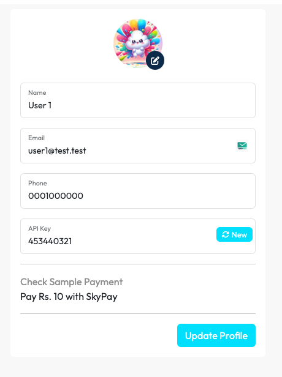
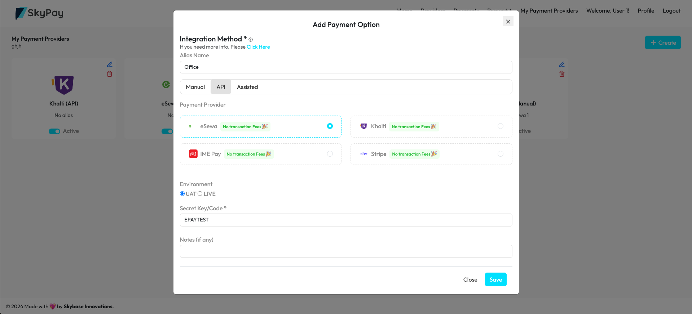

## **Prerequisites**

Before you begin, ensure you have the following:

- A Skypay merchant account.
- Your API key, available in your merchant dashboard.

## Merchant Dashboard

Skypay's Merchant dashboard & API differ based on the environment you're working in:

Live Environment Merchant Dashboard
**`https://app.skypay.dev`**

UAT Environment (for testing purposes) Merchant Dashboard
**`https://app-uat.skypay.dev`**

You can use merchant dashboard to generate access_key and setup the payment provider accounts like eSewa, Khalti, etc.

## API Key
You can find your API key in the profile menu like below:

## Set up the payment providers
You can setup the payment providers so your users can pay with these payment options like below:

Please note of the integration methods like **Manual**, **API** and **Assisted**.
This will be cover in brief in this video:
<iframe width="100%" height="400" src="https://www.youtube.com/embed/LbL0PxIPhsk?si=n6Q0dXFiXz4hHeH7" title="YouTube video player" frameborder="0" allow="accelerometer; autoplay; clipboard-write; encrypted-media; gyroscope; picture-in-picture; web-share" referrerpolicy="strict-origin-when-cross-origin" allowfullscreen></iframe>
